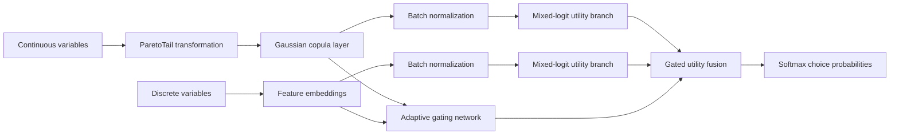

# PCMNL: ParetoTail-Copula Mixed Neural Logit for Travel Mode Choice

[](https://doi.org/10.1016/j.tbs.2026.101252)
[](https://www.python.org/)
[](https://pytorch.org/)

Official PyTorch implementation accompanying:

> Yue Liu, Guohua Liang, Ziyu Chen, and Zhixiang Gao, **“Neural integrated choice model with ParetoTail and Gaussian copula for travel behavior analysis,”** *Travel Behaviour and Society*, 44 (2026), 101252.  
> DOI: [10.1016/j.tbs.2026.101252](https://doi.org/10.1016/j.tbs.2026.101252)

The model integrates random utility theory with neural representation learning to address two recurring challenges in travel choice analysis: heavy-tailed continuous attributes and dependence among observed variables. It combines a ParetoTail transformation, a Gaussian copula, separate continuous and discrete feature streams, mixed-logit utility layers, and an adaptive gating mechanism.

> **Naming note:** The paper does not formally introduce “PCMNL” as an expanded acronym. In this repository, `PCMNLModel` is used for the implemented architecture. The descriptive expansion “ParetoTail-Copula Mixed Neural Logit” is therefore a repository-facing name derived from the implemented components.

## Highlights

- Models heavy-tailed continuous variables through a learnable ParetoTail transformation.
- Uses a Gaussian copula layer to represent dependence among transformed continuous features.
- Encodes categorical variables with trainable embeddings.
- Introduces stochastic utility coefficients to represent preference heterogeneity.
- Learns an observation-specific gate that balances continuous and discrete information.
- Provides a runnable Swissmetro travel-mode-choice example with processed data.

## Model architecture



For continuous inputs, the model maps each marginal variable to a probability-scale representation and then to a latent Gaussian space:

$$
u_j = F_j(x_j), \qquad z_j = \Phi^{-1}(u_j),
$$

where $F_j$ includes the learnable ParetoTail treatment and $\Phi^{-1}$ is the inverse standard-normal cumulative distribution function. Dependence is introduced through a learnable lower-triangular matrix $L$:

$$
\mathbf{z}_{c} = \mathbf{z}L^{\mathsf T}.
$$

The continuous and discrete streams produce separate utility vectors, $\mathbf{V}_{\mathrm{cont}}$ and $\mathbf{V}_{\mathrm{disc}}$. An observation-specific gate combines them:

$$
g = \sigma\!\left(f_{\theta}(\mathbf{z}_{c},\mathbf{h}_{\mathrm{disc}})\right),
$$

$$
\mathbf{V} = g\mathbf{V}_{\mathrm{cont}} + (1-g)\mathbf{V}_{\mathrm{disc}}.
$$

The probability of choosing alternative $i$ is

$$
P(i) = \frac{\exp(V_i)}{\sum_{k=1}^{K}\exp(V_k)}.
$$

## Repository structure

```text
.
├── configs/
│   └── swissmetro.yml          # Dataset, model, and training configuration
├── data/
│   ├── raw/swissmetro.csv
│   └── processed/swissmetro/   # Train/test feature and label files
├── model/
│   └── PCMNLModel.py           # ParetoTail, copula, mixed-logit, and gated model
├── utils/
│   ├── data_read.py            # Data loading and preprocessing utilities
│   ├── metrics.py              # Evaluation metrics
│   └── select_model.py         # Model selection
├── main.py                     # Main experiment entry point
└── train.py                    # Training and evaluation functions
```

## Dataset

The runnable configuration uses the [Swissmetro stated-preference dataset](https://transp-or.epfl.ch/pythonbiogeme/examples/swissmetro/), with three travel alternatives:

- `TRAIN`
- `SM` (Swissmetro)
- `CAR`

The paper reports 10,719 valid observations, split into 7,503 training observations and 3,216 test observations. The repository configuration specifies eight continuous variables and twelve categorical variables.

| Feature group | Variables in the default configuration |
|---|---|
| Continuous | `TRAIN_TT`, `TRAIN_CO`, `SM_TT`, `SM_CO`, `CAR_TT`, `CAR_CO`, `TRAIN_HE`, `SM_HE` |
| Categorical | `PURPOSE`, `FIRST`, `TICKET`, `WHO`, `LUGGAGE`, `AGE`, `MALE`, `INCOME`, `GA`, `ORIGIN`, `DEST`, `SEATS` |

## Installation

Clone the repository and enter its directory:

```bash
git clone https://github.com/chdliuyue/logitM.git
cd logitM
```

Create an isolated environment and install the packages imported by the current code:

```bash
python -m venv .venv
```

Activate the environment:

```bash
# Linux or macOS
source .venv/bin/activate

# Windows PowerShell
.\.venv\Scripts\Activate.ps1
```

Install the dependencies:

```bash
pip install torch pandas numpy scikit-learn pyyaml matplotlib seaborn scipy
```

The repository currently has no version-pinned `requirements.txt`. Recording the package versions used for each experiment is recommended.

## Important filename fix for Linux and macOS

`utils/data_read.py` requests `Y_train.csv` and `Y_test.csv`, whereas the files currently stored in the repository are named `y_train.csv` and `y_test.csv`. Windows normally treats these names as equivalent, but case-sensitive systems do not.

Before running the code on Linux or macOS, either update the two paths in `utils/data_read.py` to use lowercase filenames, or rename the files:

```bash
mv data/processed/swissmetro/y_train.csv data/processed/swissmetro/Y_train.csv
mv data/processed/swissmetro/y_test.csv data/processed/swissmetro/Y_test.csv
```

## Quick start

Run the default Swissmetro experiment:

```bash
python main.py
```

The entry point reads `configs/swissmetro.yml`, selects the PCMNL model, trains it with cross-entropy loss and Adam, and reports test-set loss and classification metrics.

Default settings:

| Parameter | Value |
|---|---:|
| Model | `PCMNL` |
| Batch size | 256 |
| Learning rate | 0.001 |
| Epochs | 100 |
| Continuous features | 8 |
| Categorical features | 12 |
| Total categorical levels | 83 |
| Embedding dimension | 8 |
| Hidden size | 16 |
| Alternatives | 3 |

Modify `configs/swissmetro.yml` to change these settings.

## Results reported in the paper

The values below are transcribed from the published paper; they are **not newly reproduced benchmark results from this repository**.

### Swissmetro test set

| Model | Loss ↓ | Accuracy ↑ | F1 ↑ | Precision ↑ | Recall ↑ |
|---|---:|---:|---:|---:|---:|
| MNL | 1.0996 | 0.5883 | 0.2930 | **0.7085** | 0.3523 |
| MXL | 0.8633 | 0.6073 | 0.4423 | 0.5802 | 0.4435 |
| L-MNL | 0.8734 | 0.5889 | 0.3805 | 0.5525 | 0.3945 |
| E-MNL | 0.8050 | 0.6340 | 0.5700 | 0.5924 | 0.5717 |
| EL-MNL | 0.7408 | 0.6685 | 0.6009 | 0.6382 | 0.5812 |
| Proposed model | **0.6485** | **0.7202** | **0.6649** | 0.6910 | **0.6467** |

The proposed model obtains the best loss, accuracy, F1 score, and recall in the table. MNL has the highest reported precision (0.7085), so the proposed model should not be described as the best method on every individual metric.

The paper also reports one-vs-rest ROC-AUC values of 0.86 for Train, 0.81 for Swissmetro, and 0.87 for Car.

### Ablation study

| Variant | Loss ↓ | Accuracy ↑ | F1 ↑ | Precision ↑ | Recall ↑ |
|---|---:|---:|---:|---:|---:|
| Without ParetoTail | 0.6916 | 0.7009 | 0.6198 | 0.6693 | 0.5957 |
| Without Gaussian copula | 0.6978 | 0.6772 | 0.6232 | 0.6480 | 0.6064 |
| Without gating | 0.6887 | 0.6856 | 0.6073 | 0.6629 | 0.5805 |
| Full model | **0.6485** | **0.7202** | **0.6649** | **0.6910** | **0.6467** |

### Cross-dataset evaluation

| Dataset | Sample size | Loss ↓ | Accuracy ↑ | F1 ↑ | Precision ↑ | Recall ↑ |
|---|---:|---:|---:|---:|---:|---:|
| Optima | 886 | 0.7140 | 0.7744 | 0.6452 | 0.6444 | 0.6594 |
| Netherlands | 1,739 | 0.4776 | 0.7759 | 0.6980 | 0.7229 | 0.6852 |
| LPMC | 81,086 | 0.6537 | 0.7487 | 0.5573 | 0.6521 | 0.5596 |

These rows report the proposed model only. The public repository's current main configuration and bundled processed data cover Swissmetro; the complete Optima, Netherlands, and LPMC experiment pipelines are not included.

## Interpretation reported in the paper

The learned gate provides an observation-specific indication of the relative contribution of the continuous stream:

- Mean gate value for Car observations: 0.757.
- Mean gate value for Train observations: 0.495.
- Mean gate value among observed Car users: 0.887.

The paper further uses SHAP and LIME to examine global and local feature contributions. The corresponding analysis scripts are not present in the current public repository.

## Reproducibility scope and known limitations

Please consider the following points when using the current release:

1. **Runnable scope.** The implemented main path is PCMNL on Swissmetro. In `utils/select_model.py`, the `MNL` branch is not implemented.
2. **Paper-wide experiments.** Baseline models, ablation variants, cross-dataset pipelines, SHAP, and LIME experiments reported in the paper are not exposed through the current main entry point.
3. **Stochastic evaluation.** `MixedLogitLayer` samples random coefficients on every forward pass, including evaluation. Repeated predictions may therefore differ unless random draws are fixed or predictions are averaged across multiple draws.
4. **Best-checkpoint handling.** `main.py` assigns `model.state_dict()` directly when training loss improves. A deep copy or an on-disk checkpoint should be used to guarantee preservation of the true best epoch.
5. **Filename case.** The label-file mismatch described above must be corrected on case-sensitive systems.
6. **Environment specification.** Dependency versions are not pinned.
7. **License.** No license file is currently included. Unless a license is added, standard copyright restrictions apply and reuse permissions are not explicitly granted.

## Citation

If this work is useful in your research, please cite:

```bibtex
@article{liu2026neural,
  author  = {Liu, Yue and Liang, Guohua and Chen, Ziyu and Gao, Zhixiang},
  title   = {Neural integrated choice model with ParetoTail and Gaussian copula for travel behavior analysis},
  journal = {Travel Behaviour and Society},
  year    = {2026},
  volume  = {44},
  pages   = {101252},
  doi     = {10.1016/j.tbs.2026.101252}
}
```

## Acknowledgements

The paper acknowledges support from the National Natural Science Foundation of China (Grant 52172338), the Key Research and Development Program of Shaanxi Province (Grant 2024GX-YBXM-131), and the Xi'an Science and Technology Plan Project (Grant 2024JH-GXFW-0060).

## License

This repository currently does not include a license. Add an explicit open-source license before inviting third-party reuse or redistribution.
